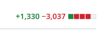

The TASBox renderer is now powered by [Daxa](https://daxa.dev/)!

<!-- truncate -->

## What is Daxa?

Daxa is a modern C and C++ abstraction layer for Vulkan, which just so happens to follow a lot of the same design guidelines as TASBox itself.
It abstracts away all of the boilerplate and most of the complexity of the Vulkan API, while avoiding making too many assumptions about how you want to use it.

Rewriting our renderer to use Daxa shaved off **1.7 thousand lines of code**!

## What do we get?

In addition to _drastically simplifying_ the renderer, we're already using a few of the extra features Daxa provides:

- Task Graphs
- Shader Hotreloading
- Slang Shaders
- Resource Names (in RenderDoc)

These combine to provide a vastly improved developer experience when working with the renderer.

There are a few other exciting features we're not taking advantage of yet, but will likely do in the future:

- Abstractions for compute and ray tracing pipelines
- Support for mesh shaders
- FSR2

Here's it in action:

<video width="100%" controls>
  <source src="/video/blog/2025-04-20-daxa/running-with-daxa.mp4" type="video/mp4" />
</video>

_Recorded at 24fps, actual framerate is much higher._

## Next steps

The driving force for integrating something like Daxa _now_ is that there are quite a few additions to the renderer coming shortly.
These would have been much more challenging if I had to crowbar them into our hand-rolled Vulkan renderer.

Over the coming weeks I'll be implementing a 2D rendering API and [Clay](https://www.nicbarker.com/clay) backend to finish up the UI implementation, and (after a few other features) will be implementing map loading with skyboxes.
