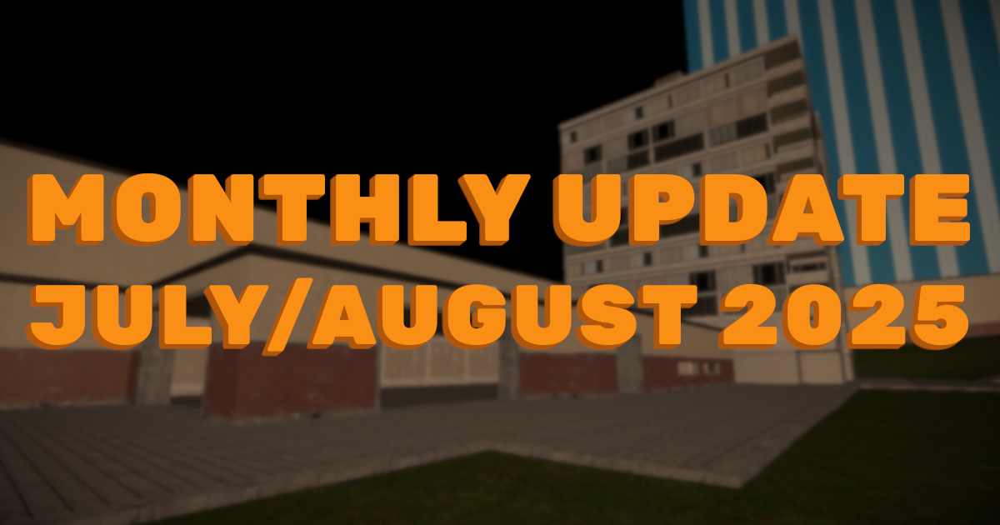

import { YoutubeEmbed } from "#components/common/youtube-embed";

A belated update on what's been happening with TASBox, but hopefully the wait is worth it... Source 1 BSP maps are now supported!

<!-- truncate -->

## Foreword

Over the past two months I've overhauled a large portion of the renderer and rewritten the entirety of BSPParser with better safety,
performance, and most importantly better maintainability. All of this culminates in support for loading many popular maps from Source Engine games.

Only the core functionality is supported, and only for uncompressed maps, but this still marks a major milestone on the road to the closed playtest 🎉.

## Visuals

BSPs are comprised of several varied and complex methods for defining the appearance of a map, which can be roughly broken down into:

- Faces - Simple map geometry
- Displacements - Detailed heightmap terrain
- Static props - Immovable entities spawned around the world
- Detail props - Foliage, decals, billboards, etc.
- 3D Skybox
- Misc. entities - Doors, ladders, moving platforms, etc.

Of the above, only faces and displacements are supported for now
(with static props being a fairly trivial addition that I'm leaving as a good first ticket for someone 👀).
The 3D skybox has a significant impact on the feel of Source 1 maps, however I don't want to implement something so complex into the renderer
while it's in such a placeholder state.

<YoutubeEmbed videoId="zGq_bxMfpmc?si=eNmasgfjSa_KLIGj" />

_(This was recorded before smoothing between displacements was implemented, you can see that in the video below)_

Everything is quite shiny at the moment, but this is just because we haven't mapped through roughness and metalness values
from the older material parameters in Source. We'll have more to show on this very soon.

## Physics

In addition to the visual aspects above, BSPs define a number of "physics models" following
the same structure as the `.phy` files used by regular 3D model assets:

<YoutubeEmbed videoId="GaZO-20nW4c?si=0zpj_B9NP_-Nv-9a" />

## Afterword

There's plenty left to do on BSP support, and a number of issues with the character controller revealed by more complex surfaces,
but I'm parking all of that for now.
Over the coming weeks I want to tidy up the engine codebase, in preparation for adding multiplayer before the end of the year.

All in all, things are shaping up nicely for beginning the closed playtest in Q1 2026!
