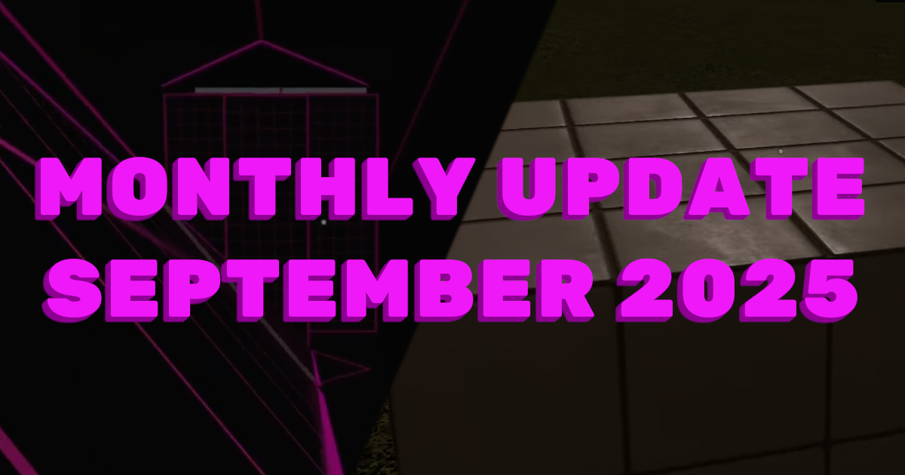
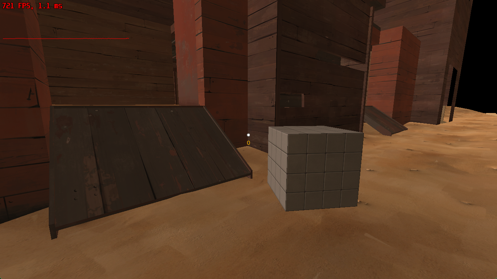
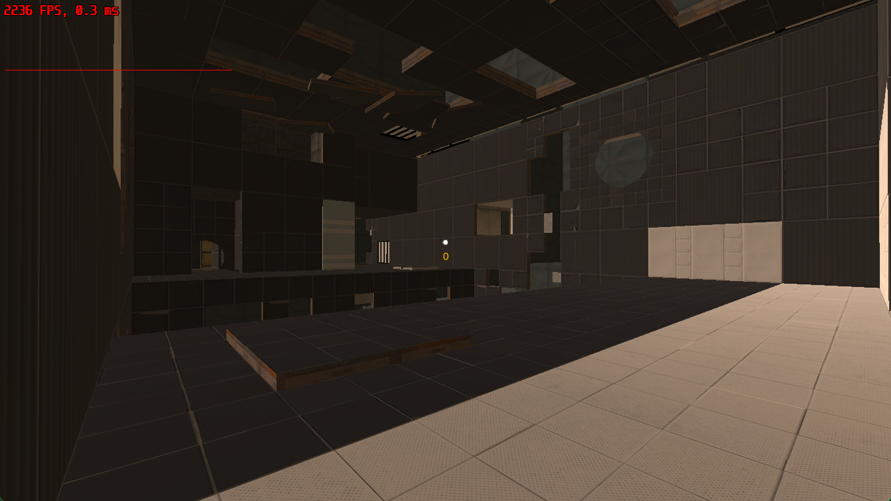

import { YoutubeEmbed } from "#components/common/youtube-embed";

A more faithful recreation of the Source player controller, improved support for BSPs, and more!
Here's what's been happening in TASBox this month...

<!-- truncate -->

## Surf's up 🏄

I've spent a lot of the past month rebuilding the movement for the Source player controller.
In the last update I showed off a basic version of the Source player, which was essentially a 1:1 copy of the player movement code from the 2013 Source SDK.
This got us most of the way there, but there were a number of bugs and the abhorrent code in the Source SDK made it nigh impossible to fix.

I took the time to distill the player controller down to only the key elements that make it _feel_ like Source,
followed by rewriting everything else from scratch. This included collision detection, auto-stepping and the overall ground movement flow.

<YoutubeEmbed videoId="voW60RJzz_o?si=opk_j78rzDlhRaZn" />

As you can see, this feels exactly like the Source engine player movement we all know and love (to the point of being able to surf and bhop),
despite now containing almost none of the original engine code!
We're putting together a more complete showcase/trailer for the player movement,
but for now you'll have to make do with my mediocre surf and editing skills.

## Improved BSP support

[@yogwoggf](https://github.com/yogwoggf) worked on lump and pakfile decompression this month in order to support a much wider range of BSPs.
This mostly covers newer maps, such as those in TF2 and Portal 2, allowing them to be loaded by TASBox and anyone using [our BSPParser library](https://github.com/tasbox-org/source-parsers/tree/master/packages/bspparser).

We still have plenty to do in terms of BSP support, but this was one of the more difficult and high value features.

## PBR materials

As a break from some of the chunkier work getting the character controller in and prepping for multiplayer,
I added support for metalness-roughness textures used by our PBR shaders.
These use the [source-pbr](https://github.com/tasbox-org/source-pbr) textures I created a while ago for GMod DXR and VisTrace,
which are getting a new lease on life by bringing higher fidelity graphics to TASBox.

<YoutubeEmbed videoId="fn568mqaRwA?si=_dMqacB324F-o0xY" />

We still have a rudimentary render pipeline, but just by adding these textures you can see the sort of visual fidelity we get simply by using the physically-based BSDF from VisTrace.

## Miscellaneous prep for multiplayer and Closed Playtest

Finally, we have a few miscellaneous changes which aren't worth a section on their own, but give you an idea of what we're working on next:

- Split into server/client/shared sub-projects
- Cleaned up some long-standing tech debt in the project (mostly around consistency in the Lua API and file loaders)
- Fixed and added a CI pipeline for the Windows build
- Moved all remaining dependencies over to vcpkg (C++ package manager) for better caching in our CI (pipelines reliably take 3 minutes or less)
- Combined the various Source file format parsers into a single [source-parsers](https://github.com/tasbox-org/source-parsers) repository
- Fixed a few small bugs
