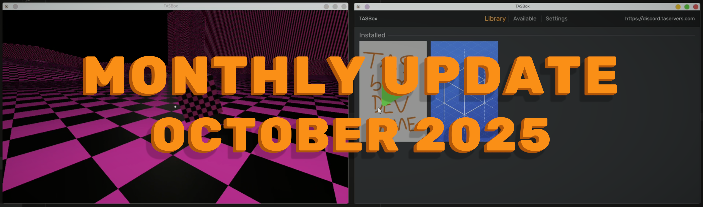

import { YoutubeEmbed } from "#components/common/youtube-embed";

What's better than a singleplayer sandbox game? A multiplayer one.
Keep reading to see how we're implementing multiplayer in TASBox...

<!-- truncate -->

## Multiplayer for dynamic worlds

During my work on TASBox, I've had to solve many problems which don't generally exist in game or game engine development, or at least which have been made more difficult than usual.
This is because TASBox is a true sandbox game, with as few assumptions made as possible about how you're going to play it.

You're free to load in whatever assets and scripts you want, when you want.
You might want to play a singleplayer roguelike, or join a server hosting a hundred other players in a large open-world environment.

When it comes to networking, this makes it challenging to decide on an architecture, and there's no architecture which will satisfy all manner of experiences perfectly.
After a few weeks of reading up on the topic, I shortlisted two options:

- Snapshot Interpolation - As used by Quake, Source, and many other competitive shooters
- State Synchronisation / TRIBES model - As used by Halo Reach and Unreal Engine

Both of these would have been a good fit, but I chose the TRIBES model for better scalability.
While Snapshot Interpolation would have made the development experience consistent with Garry's Mod,
the prioritised rolling updates of the TRIBES model can scale (theoretically) endlessly.

You will eventually hit a limit where the rate at which you send updates for important entities is too infrequent, and the client-side extrapolation becomes noticeable,
but with a clever approach to prioritisation you can make "important entities" a very small subset of the world.

## Multiplayer in action - Demo

Enough talk, how does it look?

Well, not great at the moment...

<YoutubeEmbed videoId="mdTGAFlNhrE?si=rdXX5Zuxe4bohjLc" />

...but that's expected! This is what you get from literally just throwing state updates at the client 60 times per second,
without any buffering to fix reordering or jitter (not that it's easy to spot with YouTube's bitrate).

I also got a cool effect when I started to network over materials:

<YoutubeEmbed videoId="qIyKXqxUYxc?si=UMkOmgC1tFApj7Mt" />

This is a byproduct of the TRIBES network model.
Because I'm only sending a subset of materials each tick (in a sort of sliding window), they arrive at the client gradually.

I could hide this with a loading screen until we've confirmed with the server that the initial state of the world has been loaded,
but I'm thinking of making the loading screen rendering controllable by the game, and happen after the client has connected.
This way, you could show the loading process (maybe from a few camera angles?) behind a translucent loading panel, or no loading panel at all!

## The boring (but difficult and necessary) bit

The work needed to implement this initial WIP version of multiplayer was fairly simple.
The thousands of lines of refactoring to get the engine into a state primed for networking was not.

I spent most of October doing the following:

- Splitting the file format loaders across server and client realms, with a unified way of representing images and meshes in both environments
  - On the client, images and meshes reference GPU resources containing their respective data, while on the server they contain the path to an asset and other relevant metadata.
- Decoupling huge swathes of the codebase from the renderer, to allow more of the engine to be shared between client and server (in fairness this was knowingly accumulated tech debt)
- Exposing **almost 50 new methods** for getting and setting properties of entities, removing the black boxes of `Entity.fromAsset3d` and `Entity.fromMap` (those still exist as a convenience, but they're 100% written in Lua now!)
- Introducing a reference counted resource ID system internally for materials and skeletons, inspired by Daxa. This allowed for deduplication and more efficient networking of these objects.
- Many more small fixes and tweaks which I spotted while writing all of this and don't have a list of...

Oh, and I added sections to organise those 50 new functions better on the docs pages 😉
