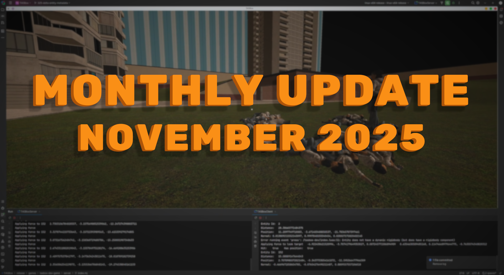

import { YoutubeEmbed } from "#components/common/youtube-embed";

This month, I've implemented two major networking features which bring multiplayer to an almost playable state...

{/* truncate */}

## Replicating collisions

In my last post I mentioned we were using the TRIBES network architecture.
This makes client-side prediction a case of replicating _all_ physics state to the client, who will then simulate the world in parallel.
A lot of work to be sure, but far easier to get right than if we were using snapshot interpolation like Source.

<YoutubeEmbed videoId="CbF3-FIMN64?si=Rvsq4ufjXuTm3C5A" />

You might notice in the above video that the lag is awful, even when only a few ragdolls are spawned in.
The position of each bone is taking longer to update every time a new ragdoll is spawned, made obvious by not simulating their physics on the client\*.
This is where our next feature comes into play...

## Delta encoding

You can save on network bandwidth by trying to compress your data into fewer and fewer bits,
but you can save even more by never sending those bits in the first place!

Delta encoding is an approach whereby the server tracks the state of the world for each client,
and networks only properties of the world which have _changed_ to that client (i.e. a delta).
If no properties of an entity have changed for a given client, then that entity does not need to be networked at all.

<YoutubeEmbed videoId="zmB9G-3yTTM?si=Yl0Lb4hnZXSA7QPb" />

With delta encoding we can now spawn 10s of ragdolls without much latency being introduced.

As you can imagine, tracking which clients have received which version of every property on every entity is a lot of work,
and this is what took up most of my time (both in research and in implementation). I think the result is worth it though.

## Afterword

That's all for now. The MVP for multiplayer is almost complete, with user input being the last major hurdle to overcome.
December will be implementing this along with some bug fixes and optimisations, before moving onto the creation of an arena shooter game.
This arena shooter will be the focus of the closed playtest, showcasing what TASBox is capable of while being small in scope.

I can't wait to play TASBox with you in 2026!

_\*For technical reasons, ragdolls are simulated on the client as kinematic rigid-bodies,
and thus aren't including their linear and angular velocity in client-side prediction.
We will be improving their prediction in the future._
