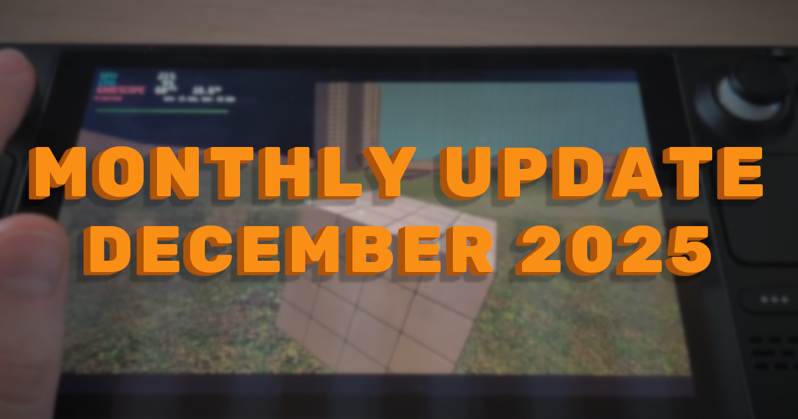
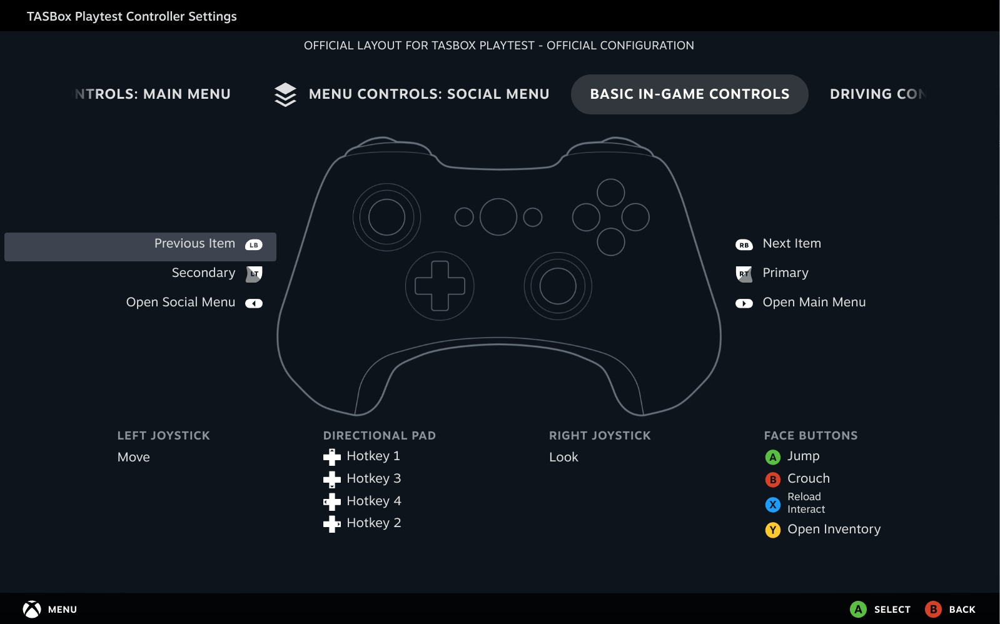

import { YoutubeEmbed } from "#components/common/youtube-embed";

Steamworks, Steam Input and Steam Deck - TASBox is coming to Steam!



{/* truncate */}

## Steamworks SDK and preparing for Steam release

I've gone back and forth for a while on whether we should release on Steam or not.
There are a number of challenges with doing so, but also a number of benefits:

- The Good:
  - Steam provides a platform to reach more people than we could on our own (or through similar but less popular platforms such as itch.io)
  - Steamworks solves user authentication and server discovery, as well as providing social features such as friends
  - Steam Input lets us more easily support a wide range of controllers
  - Steam's distribution network means we don't need to worry about installation guides or delivering updates to players
  - And more, but those are the big selling points
- The Bad:
  - The Steamworks SDK Access Agreement adds a potential barrier to developers wanting to work on the engine
  - The Steam Distribution Agreement does not waive all liability and warranty like the MIT License does
    - In practice this means we have more strict requirements for testing and QA before release
  - Coupling to Steamworks limits the ability for someone to fork TASBox for their own needs, as they would need to register as a Steam Partner

I finally decided to bite the bullet and register as a Steam Partner this month though, as I think the benefits outweigh the costs.
To mitigate some of the bad points above, I've introduced a facade over the Steamworks SDK that allows you to run TASBox without Steam.

When it comes time for the closed playtest, you'll now take part through a Steam Playtest rather than being given access to the repository.

## Steam Input

The first feature I implemented after deciding we were going to release on Steam was Steam Input.
Steam Input is Valve's library for supporting a wide range of input devices,
using Steam's built-in controller layout configurator.

Integrating Steam Input required me to completely rethink how user input is presented to package developers.
The initial version of input in TASBox gave developers the flexibility to define custom bindings to any keyboard or mouse input,
which isn't exactly compatible with Steam Input's model of predefined actions...

We could create very generic actions (`A Button`, `DPad Down`, etc.), but this has two major issues:

- It assumes Steam Input will only ever support traditional controller input devices
  - This is already false for the Steam Deck and Steam Controller (old and upcoming versions) as they have trackpads and gyros
- It puts the responsibility on package devs to ensure their games and addons work well with controller
  - And even if two developers implement perfectly sensible bindings, it doesn't mean those bindings will be consistent with each other

Instead, I completely rewrote TASBox's `Input` API to follow the Steam Input model of Actions and Action Sets,
and designed four action sets (plus some layers) to cover a range of use cases:

- Menu
  - All menu navigation. Enables a virtual cursor which can be controlled using a mouse _or_ controller
  - Has layers to dismiss the menu depending on the `MenuType` specified.
    This lets players close pause menus, chat windows and inventories with the same button they used to open them
- Basic
  - Generic control scheme for controlling 2D and 3D characters using left stick
- Sim Driving
  - Specialised control scheme for driving-focused experiences
- Sim Flying
  - Specialised control scheme for flying-focused experiences



These action sets provide a collection of semantic actions which are both widely applicable,
and specific enough to hopefully ensure consistency between games and addons.
Packages can freely swap between these action sets to respond to gameplay events such as exiting a vehicle.

## Steam Deck

This one was a bit of a freebie given TASBox is developed Linux-first,
but it did force me to improve the release process to ensure TASBox works on a clean installation.

<YoutubeEmbed videoId="G9A2oqkYPsQ" />

The main changes are:

- TASBox now uses a CMake install command to copy build artefacts to the `/release` dir
- Various thirdparty dependencies which aren't automatically copied to `/release` are now copied (`libslang-compiler` and Daxa shaders)
- RPATH is now correctly overwritten on Linux builds to point to the executable's directory

## Networked Input

The changes I made to how we represent input also made it _much_ easier to send over the network.
Because we know what actions exist ahead of time, we guarantee that the actions are consistent between server and client
(assuming of course that the server and its clients are on compatible engine versions).

Simply sending our inputs to the server each tick isn't enough to get proper networked input working though.
The client's input may not reach the server before the next server update message reaches the client,
or there could be latency and/or packet loss on the connection.
To mitigate these issues, TASBox reapplies old input snapshots when we receive updates from the server,
all but eliminating perceived lag up to a latency proportional to how many input snapshots we buffer.

<YoutubeEmbed videoId="pXDXFfAg7oc" />

These changes to input manifest in the following easy to use scripting API (you might recognise `isFirstTimePredicted` 😉):

```moonjuice
-- On the server:
Input.addEventListener("basicActionSet", fn(player, actions, deltaTime)
  if actions.jump.wasPressedThisFrame then
    def playerId = Player.getId(player)

    print(string.format("[Server] Player %s jumped!", playerId))
  end
end)

-- On the client:
Input.addEventListener("basicActionSetPredicted", fn(player, actions, isFirstTimePredicted, deltaTime)
  if actions.jump.wasPressedThisFrame then
    def playerId = Player.getId(player)

    if isFirstTimePredicted then
      print(string.format("[Client] Player %s jumped!", playerId))
    else
      print(string.format("[Client] Player %s jumped! (reprediction)", playerId))
    end
  end
end)
```

## UI Scrolling & Clipping

A small but impactful feature I added was the ability to control the overflow behaviour of UI elements,
including _scroll_!

<YoutubeEmbed videoId="vq4ptSnegag" />

You can create a vertically scrolling container using the following snippet:

```moonjuice
def { .Text, .Container } = UI

def ScrollContainer = UI.createComponent(fn(props, children)
  fn() {
    Container({
      .name = "ScrollContainer",
      .style = {
        .direction = UI.Direction.Vertical,
        .gap = 16,
        .overflowY = UI.Overflow.Scroll,
      },
    }, fn() {
      Text({ "This text" }),
      Text({ "will scroll" }),
      Text({ "if it" }),
      Text({ "overflows" }),
    } end)
  } end
end)

UI.render(ScrollContainer, UI.SCREEN)
```

There's also an `overflowX` property for horizontal scrolling and clipping.

## Misc Improvements

- Changed all executable-relative paths to be relative to the working directory
  - This makes local dev much smoother and removes the need for disabling the filesystem sandbox in debug
- Fixed throwing when GLFW raises invalid keyboard events for certain mouse buttons
- Fixed MoonJuice giving unary operators higher precedence than everything else
  - e.g. `not foo.bar` was parsing as `(not foo).bar` instead of `not (foo.bar)`
- Fixed error when package has no `index.{mj/luau/lua}` in its mount path
- More misc changes that were absorbed into other PRs as I went
