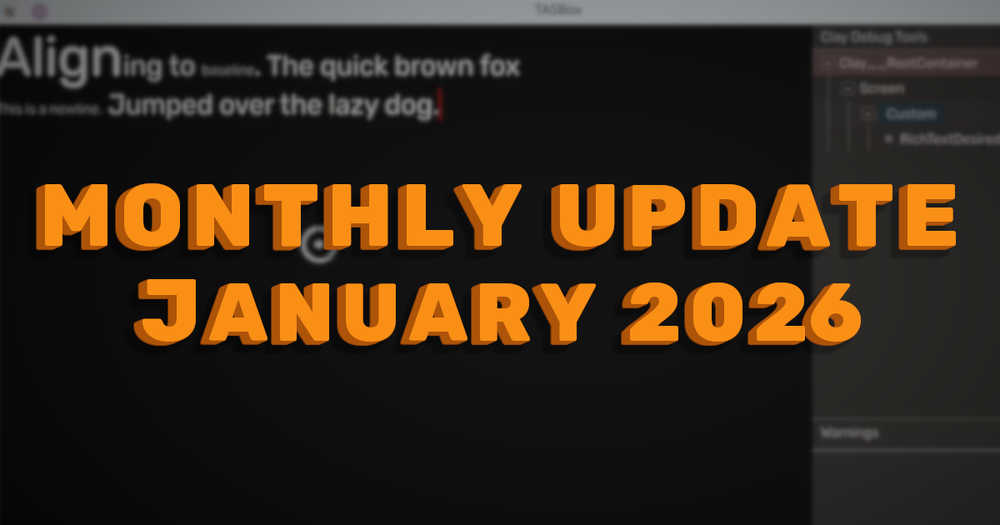

import { YoutubeEmbed } from "#components/common/youtube-embed";

Happy new year! Rich text editing, a networking API, and a number of fixes/improvements this month in TASBox



{/* truncate */}

## Rich Text

The UI stack we're using in TASBox is a custom API and rendering system sandwiching the Clay UI layout library.
Clay is great as a lightweight and flexible library to support the kind of scripting API we want to provide in TASBox,
however this means we have to implement a lot of the functionality ourselves.

One such piece of functionality is the ability to input text. While we could get away with simple single-line plain text editing,
I wanted to future-proof ourselves with a single common implementation which would support (or be able to support) the following:

- Simple single-line text editing
- Multi-line text editing
- Mixed fonts, font sizes, vertical alignment, etc.
- Caret movement
- Gamepad support with Steam's onscreen keyboard

All while keeping the scripting API as simple as possible...

<YoutubeEmbed videoId="SjVQBat5P_M" />

We're most of the way there already as you can see in the video above, however there's still some missing features.
For now, we're only implementing a single-line text input component as standard:

```moonjuice
def { .Text, .TextInput, .Container } = UI

def App = UI.createComponent(fn()
  def text, setText = State.createSignal("Click me")

  fn() {
    Container({
      .style = { .direction = UI.Direction.Vertical }
    }, fn() {
      TextInput({
        .text = text,
        .onTextChanged = setText,
        .style = {
          .textColour = Colour.fromHex("FF0000"),
          .fontSize = 26,
        }
      }),
      Text({ "You entered: \'", text, "\'" })
    } end)
  } end
end)

UI.render(App, UI.SCREEN)
```

But you can access the full range of implemented functionality right now directly through the DOM-style API:

```moonjuice
def element = UI.createRichTextElement()

-- For a full list of rich text methods and token styling options,
-- see the documentation
UI.setTokens(
  element,
  {
    { .content = "Hello world!", .style = { .fontSize = 32 } }
  },
  { 0, 0 }, -- Start of the selection to replace
  { 0, 0 } -- End of the selection to replace
)

UI.appendElement(UI.SCREEN, element)
```

## Networking & Serialisation APIs

We've had networking in the engine since the end of December,
but until now we had no way for games and addons to interact with it directly.
We wanted to provide a simple and type-safe way for package developers to send data reliably over the network,
for chat messages, events, and other relatively infrequently changing data.

We did this by introducing two new related (but independent) APIs.

### Networking

The Network API provides a simple and somewhat low-level interface for sending and receiving reliable messages across the network.
This takes the form of a likely familiar `send` and `receive` pair of functions on the server and client,
allowing clients to communicate with the server, and for the server to communicate with individual clients.

```moonjuice
-- On the server
Network.receive("myMessageToServer", fn(player, payload)
  print(buffer.tostring(payload))
end)

def payload = buffer.fromstring("Hello client")
for _, player in Player.getConnected() do
  Network.send(payload, "myMessageToClient", player)
end

-- On the client
Network.receive("myMessageToClient", fn(payload)
  print(buffer.tostring(payload))
end)


-- The payload comes first in the .send functions to allow for piping
"Hello server" |> buffer.fromstring |> Network.send("myMessageToServer")
```

There's no need for the names to be different between client and server, that's just to make the example clearer.

You may notice a couple of things about this example:

- We've not had to register any network message names manually
  - This is because each name is turned into a 64-bit hash and included on every message
  - In theory this could lead to collisions, but it's practically impossible to occur, and is nicer than having to manually track and reuse message IDs
- We're only able to send and receive raw buffers, how am I meant to send more complex messages?
  - That's where the next new API comes in

### Serialisation

Sending a simple string between server and client is fine,
but we're probably going to want to send more complex types such as tables and arrays.
Additionally, we're going to want to save as much data as possible to reduce network load.
This means avoiding networking information where it can be inferred (like table keys), using bit-packing where possible,
and other such data optimisation techniques.

Enter the Serialiser API:

```moonjuice
-- See the documentation for a full list of available schema types
def schema = Serialiser.table()
  |> Serialiser.withField("foo", Serialiser.bool())
  |> Serialiser.withField(
    "bar",
    Serialiser.array({
      .fixedLength = 3,
      .elementSchema = Serialiser.vector3()
    })
  )

def toSerialise = {
  .foo = true,
  .bar = {
    vector.create(1, 2, 3),
    vector.create(4, 5, 6),
    vector.create(7, 8, 9),
  }
}

-- You can also write in-place into a buffer,
-- and measure the size it will take (see the docs)
def serialised = toSerialise |> Serialiser.write(schema)
def deserialised = serialised |> Serialiser.read(schema)
```

The Serialiser API provides a fluent API for defining _schemas_, and for using those schemas to read and write data to and from buffers.
By sharing the same schema between client and server,
you're able to send data across the network _without encoding field names or any other type information_.

But it doesn't stop there. Because we've made serialisation its own standalone API which can operate on _any buffer_,
you can leverage it with more than just networking.
Reading and writing binary-encoded files and storing compressed data in an in-memory cache are two other use-cases that spring to mind.

These two APIs nicely illustrate the design principles we follow when building out TASBox's scripting API,
creating a collection of small, independent APIs which work together to enhance each other's functionality.

## Other Networking Fixes & Improvements

We've made a number of other fixes and improvements to networking in January which don't warrant a dedicated section on their own:

- Sending server input to clients
  - This allows us to trigger input events for both the local and remote players on each client,
    making it easy to trigger effects like muzzle flashes and walking animations without networking anything by hand
- Jitter buffer
  - Ensures unreliable messages are applied in order and at a consistent rate, even if it means dropping a few in the process
- Per-player replication priority tracking
  - This was a known not-yet-implemented piece of functionality which ensures that an entity networked to player A
    maintains its existing priority when checking if it should be networked to player B,
    rather than resetting the priority for both of them
- Fixed stale predictions on the client not being overwritten by the server
  - With the introduction of delta tracking, we made the server not send updates for pieces of state (like positions)
    which hadn't changed since the last acknowledged snapshot ID
  - This lead to an issue where the client could make predictions about an entity (like applying force on click)
    which were never corrected by the server
  - To fix this, we've made two changes:
    - Prevented changing most of the replicated properties from the client (mesh, materials, colliders, etc.) as we couldn't think of a strong use-case
    - Tracked deltas on the client for predictions made about transforms and velocities,
      sending them to the server each tick until a new value is received so that the server can mark them as dirty

## Update on the Closed Playtest

The original plan was to begin the closed playtest in Q1 of this year, however a couple of factors have made this impossible:

- While releasing on Steam will no doubt be immensely beneficial to TASBox (through discoverability, ease of use, and the Steamworks infrastructure),
  it does mean we need to have a build of the game which can be reviewed and approved by Valve
  - This means we need a better UX (simple connection to a server, or "singleplayer" implemented)
  - A game developed for it which demonstrates that it's playable (the arena shooter and/or sandbox)
  - A collection of included assets to avoid the need for other games to be installed in parallel
- I had also made estimates under the assumption that there would be more contributions made by people in the developer preview,
  not necessarily to the engine itself, but by creating games and addons
  - This has unfortunately not happened, and so I will need to both implement the rest of the engine _and_ develop the games and addons on top of it
  - Bear in mind that I only have the weekends (and maybe a few hours across the week after work) to develop TASBox

So when will the closed playtest start? That will largely depend on when I'm confident in submitting a build of the game to Valve for review.
It will take probably another few months to get the _engine_ into a state where that's possible,
and then a few more still to develop _either_ the arena shooter _or_ sandbox gamemodes.

This would put the start of the playtest sometime towards the end of this year,
which is later than I hoped but perhaps for the best to have a more complete experience to show you.
If you're in the developer preview right now or thinking about joining, and both willing and have the time to work on one or more games for TASBox,
then please get in touch on Discord: https://discord.gg/WY7euMzUtP

Even one person working on a game in parallel would likely cut the time to playtest _in half_.
