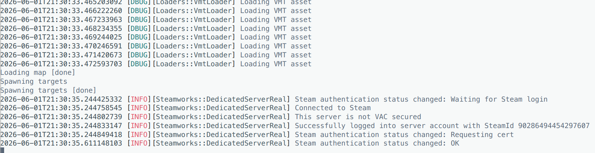
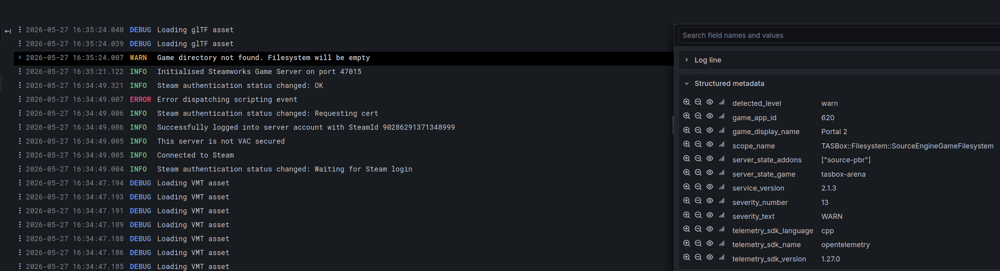
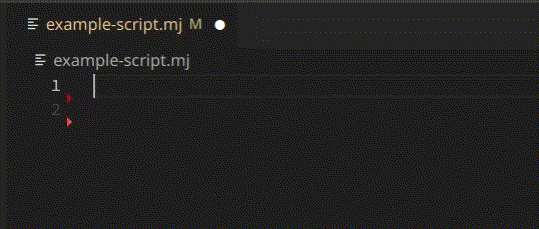

After a 2-month hiatus for work reasons, we're back into the swing of things
with some major structural changes leading up to the closed playtest.

## Player usernames

Starting with a contribution from [@yogwoggf](https://github.com/yogwoggf): The player usernames API.

This is a small but impactful change which lets you implement core social features in games and addons, including chat and name tags.
You can find the documentation for this method here: [Player > getName](/docs/api/Player/function/getName)

While the API is simple, an interesting technical challenge is that the Steamworks SDK provides no way AFAICT
to get the username of a connected player from the server environment.
Each connected client must instead send their name to the server manually.

This makes it easy for a player to spoof their name on the server though.
A future enhancement could be to have all players send all connected player names to the server,
and choose the name with the most consensus for each SteamID.

## Production-ready logging

One of the two major changes this month is a proper implementation of logging in the engine.
Up until now we've been making do with simple prints to console throughout the codebase, but this has a number of issues:

- Limited options for server operators when trying to use logs (best you can do is scrape stdout)
- Lack of structure in the engine leads to inconsistency (how log messages are formatted, what log levels are available, etc.)
- Lack of metadata/context information for log entries (all you get is what you can reasonably fit in the log line, and you have to duplicate the info each time)

We'll also want to export logs to - at minimum - a debug interface in-game and to disk for clients so they can send us error logs.
Enter stage left: OpenTelemetry.

### What is OpenTelemetry?

OpenTelemetry is an open standard for the collection of observability _signals_: logs, metrics and traces.
It defines models for these signals, as well as implementing a consistent SDK across a number of languages for instrumenting libraries and applications.
Most importantly, it defines a consistent interface for upstream collectors such as Grafana.

This means we can support one standard, and automatically be compatible with pretty much every
modern piece of observability infrastructure on the market.
It also paves a road for introducing metrics and traces, as opposed to libraries which only provide logging functionality.

While OpenTelemetry is quite common in the enterprise web/app development space,
I've not seen it integrated with a game engine before.

### Here's how we're using it

Almost all instances of writing directly to console have been replaced with a custom abstraction over the OTel C++ SDK
(looks very similar to C#'s `ILogger`), and exporters are configured for both console output _and_ OTLP gRPC.

Here's an example of logs in the console:

That's fairly standard. Now lets export these logs over OTLP to a tool which supports structured logging:

This is using a locally running instance of the `grafana/otel-lgtm` Docker image to enhance development.
You can see useful metadata above, both specific to that log entry (e.g. the missing game name) and
scoped context information (like the active addons) which will be attached to all log entries in that scope.

With support for proper telemetry collection tools, server operators gain deeper
insights into the health of their server, and reduce the time needed to find and fix bugs.

### What's next

This is just the beginning for enterprise-grade observability in TASBox.
In the future we'll be adding both metrics and tracing to the engine,
and we'll expose at least a subset of this functionality to the scripting environment so packages can leverage it too.

## MoonJuice goes Open Source early!

Creating a custom programming language takes a lot of code,
not just for the language but for the surrounding tooling.
Having all of this bundled into the TASBox repository makes the codebase harder to navigate.

So, I've extracted MoonJuice into a dedicated repository, MIT licensed and available right now on GitHub: https://github.com/tasbox-org/moonjuice

The key changes:

- Several bug fixes and improvements
- Basic LSP server
- VSCode extension
- Decoupled from TASBox and rewritten in Rust

Keep reading to find out more.

### New language features

As part of the migration, I had the opportunity to reread the codebase in full.
This led me to spotting a number of bug fixes and refactoring opportunities,
which in turn made it easier to implement some much-needed language features:

- Multiline strings - All strings are multiline, and you can use three or more quotes in a row (e.g. `"""foobar"""`) to avoid needing to escape nested quotes
- Format strings - Additionally, all strings now support interpolation (e.g. `"Hello, {name}!"`)
- Proper escape sequence handling - No more needing to escape apostrophes in double-quoted strings
- `def` and `mut` now mean something in the Luau transpiler, leveraging the new `const` keyword in Luau

Plus a number of smaller improvements to how certain syntax errors are reported.

### LSP server and VSCode extension

The key driver for this migration was the need to create a language server.
We'd been making do with basic syntax highlighting using CLion's custom syntax definition feature,
but the limited editor functionality and lack of diagnostics made the developer experience miserable.

By creating a language server, we have an editor-agnostic way to provide support for MoonJuice.
Currently, this takes the form of a vscode extension to provide syntax highlighting,
bracket/quotes/indentation completion and syntax error diagnostics.

There's still far more to be done here (completions, more semantic highlighting, find references, etc.),
but I think this is the minimum to make the language usable as we move towards the closed playtest.

We would also like to provide official support for the Zed and JetBrains editors,
however I encountered some issues here which left vscode as the only easy option for now:

- [Improve syntax highlighting performance in JetBrains IDEs #13](https://github.com/tasbox-org/moonjuice/issues/13)
- [Investigate Editor Support: Zed #14](https://github.com/tasbox-org/moonjuice/issues/14)

### Why Rust

Lastly, you might be wondering why I decided to rewrite MoonJuice in Rust
(and no, I'm not planning on rewriting TASBox itself. I also didn't use AI for the rewrite, unlike a certain JavaScript runtime).

I'm generally a Rust sceptic, largely due to the syntax. However, there were some very compelling reasons for using Rust here:

- Native monorepo support - The primary reason. Setting up a CMake monorepo with internal dependencies while also publishing them externally is a pain
- More mature LSP framework
- Pattern matching lends itself to the kinds of algorithms involved in writing lexers, parsers and transpilers

And while other languages offer similar functionality,
they do not integrate as well with a C++ codebase.
