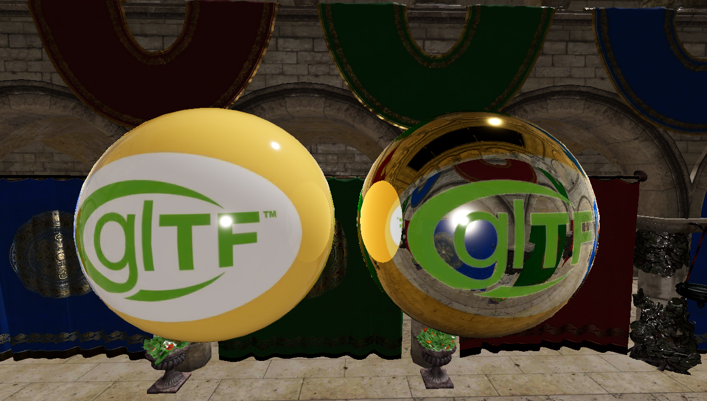

import { YoutubeEmbed } from "#components/common/youtube-embed/index.ts";

## Ray Tracing

There are many approaches to solving lighting in video games,
each with different pros and cons and each suiting different art styles and use-cases.
As TASBox allows players to create whatever worlds they can imagine,
we need to tailor our lighting approach to the completely unpredictable nature of the environment.

This immediately rules out any lighting approach which requires a mostly unchanging (i.e. static) scene,
namely baked and static probe-based lighting.
We could provide players with the tools to configure these for their specific experiences,
but this shifts too much complexity onto the player for what we're trying to achieve with TASBox.

Even limiting ourselves to 100% dynamic lighting, there are still a number of different approaches, each of which broadly falls under one of:

- Screen-space (SSAO, SSGI, SSR, etc.)
  - Fast, but low quality (artefacts on disocclusion)
- World-space raster (shadow maps and _dynamic_ probes captured using a traditional raster pipeline)
  - Works on older GPU architectures, but doesn't scale well (each world-space view rerenders the entire scene from scratch)
- World-space ray-tracing
  - Limits us to GPUs with RT support, but this is now ~8 years worth of GPUs
  - Scales far better than raster for more lights, probes, scene complexity, etc. assuming stochastic sampling is used to meet a fixed ray budget
  - Stochastic algorithms commonly used to lower ray count produces visual noise

The obvious choice for us was ray-tracing (with screen-space effects in the cards if we want to support older GPUs).

### Ray Tracing in TASBox

To implement real-time ray tracing in TASBox with Vulkan, a number of changes to the engine's 3D asset pipeline and renderer were needed.
Contrary to what you might think, tracing a ray in Vulkan is not really the hard part,
it's the dance you have to do in order to create and maintain the various data structures needed to trace against.

Thankfully, Daxa eliminates the worst of the boilerplate here, but a number of changes were still needed.
The 3D render pass now looks something like (simplified):

1. Write all materials and skeleton joint transforms to the GPU
2. For each renderable entity
    1. Write a description of the entity (its vertex buffer, materials, etc.) to the GPU
    2. If the entity's mesh does not yet have a BLAS, queue its creation and store the new BLAS ID on the mesh
    3. Create a BLAS instance definition for the entity and its mesh (the TLAS can have multiple instances of the same BLAS)
3. Build all queued BLASes on the GPU's compute queue
4. (Re)build TLAS from scratch using this frame's BLAS instances on the compute queue
5. Submit draw calls for all recorded entities on the GPU's main/graphics queue

I've only briefly played around with ray tracing in TASBox so far, but this should be enough to give you a taste of what's to come:

<YoutubeEmbed videoId="qLewj73zZLQ"/>

### Next Steps

This is only the foundation of high-fidelity graphics in TASBox,
there's still a long way to go before I would consider TASBox's renderer ready for release:

- Implement skinned mesh BLAS building
  - Moving vertex skinning to a compute shader and dynamically refitting/rebuilding the BLAS as the skeleton's joints update
- Direct lighting solution (likely to be reservoir sampling)
- Diffuse indirect lighting solution (likely to be either DDGI or spatially hashed radiance caching)
- Specular reflection and transmission (all degrees of roughness)

## Daxa Upgrade

As part of the ray tracing work above, I undertook the massive upgrade from the outdated version of Daxa we were using
all the way to vLatest. We hadn't upgraded sooner as there wasn't much work to be done on the renderer yet,
and Daxa dropped support for vcpkg making the upgrade more challenging.

I also made the switch from Slang to GLSL, as I already needed to rewrite significant chunks of the renderer for the upgrade.
Slang has a lot of nice features, but the rampant LLM usage is concerning and the lack of static linkage needlessly complicated our release process.
